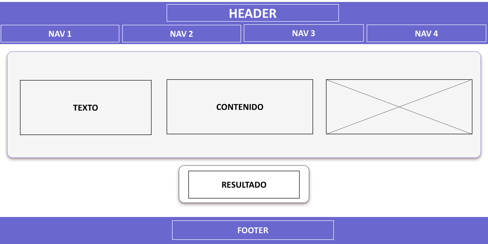
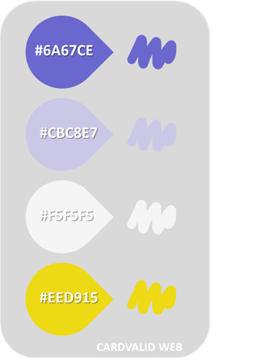
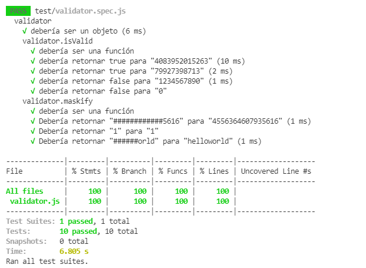
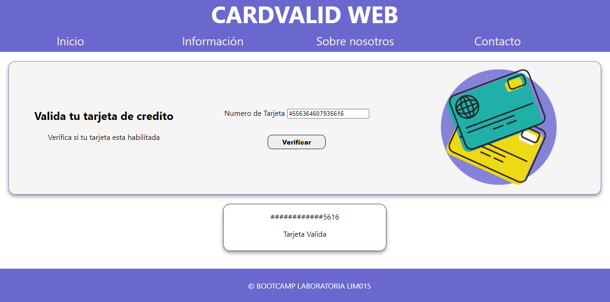

# CARDVALID WEB

## Índice

* [1. Resumen del proyecto](#1-resumen-del-proyecto)
* [2. Objetivos de aprendizaje](#2-objetivos-de-aprendizaje)
* [3. Consideraciones generales](#3-consideraciones-generales)
* [4. Hacker edition](#4-hacker-edition)
* [5. Consideraciones técnicas](#5-consideraciones-técnicas)
* [6. Checklist](#6-checklist)

***

## 1. Resumen del proyecto

`CARDVALID WEB`, es una aplicación web que le permitira al
usuario validar el número de una tarjeta de crédito. Además, tiene la
funcionalidad para ocultar todos los dígitos de una tarjeta menos
los últimos cuatro.

* Investigación UX:
  1. Los usuarios buscan poder verificar si la tarjeta que tienen es valida y usaran `CARDVALID WEB` para comprobarla.
  2. De una manera sencilla solo ingresando el numero de tarjeta obtendra el resultado de si es valida o invalida con un mensaje.
  3. Primer prototipo en papel de `CARDVALID WEB`
  

  4. El feedback recibido me indicaron las mejoras a realizar y las realice.

  

  5. Imagen del prototipo final.
  


## 2. Objetivos de aprendizaje

Se utilizo, para construir `CARDVALID WEB` que interactuará
con lx usuarix final a través del navegador, utilizando HTML, CSS y JavaScript
como tecnologías.
* Usa solo caracteres numéricos (dígitos) en la tarjeta a validar [0-9].
* La lógica del proyecto debe estar implementada completamente en JavaScript.


## 3. Consideraciones generales
#### Visualmente (HTML y CSS)

* Maqueta de prototipo final en una herramienta de diseño


* Los colores que se utilizaron



* Resultado final


#### Archivos (JavaScript)

##### `src/validator.js`

Acá se escribio las funciones necesarias para que el usuario pueda verificar la
tarjeta de crédito y ocultar los dígitos de su número de tarjeta.
Esta función es pura e independiente del DOM.

Para esto se implemento el **objeto `validator`**, el cual ya se encuentra
_exportado_ en el _boilerplate_. Este objeto (`validator`) contiene
dos métodos (`isValid` y `maskify`):

* **`validator.isValid(creditCardNumber)`**: `creditCardNumber` es un `string`
con el número de tarjeta que se va a verificar. Esta función debe retornar un
`boolean` dependiendo si es válida de acuerdo al [algoritmo de Luhn](https://es.wikipedia.org/wiki/Algoritmo_de_Luhn).

* **`validator.maskify(creditCardNumber)`**: `creditCardNumber` es un `string` con
el número de tarjeta y esta función debe retornar un `string` donde todos menos
los últimos cuatro caracteres sean reemplazados por un numeral (`#`) o 🐱.
Esta función deberá siempre mantener los últimos cuatro caracteres intactos, aún
cuando el `string` sea de menor longitud.

    Ejemplo de uso

    ```js
    maskify('4556364607935616') === '############5616'
    maskify(     '64607935616') ===      '#######5616'
    maskify(               '1') ===                '1'
    maskify(               '')  ===                ''
    ```

##### `test/validator.spec.js`

En este archivo tendrás que completar las pruebas unitarias de las funciones
`validator.isValid(creditCardNumber)` y `validator.maskify(creditCardNumber)`
implementadas en `validator.js` utilizando [Jest](https://jestjs.io/es-ES/).
Tus pruebas unitarias deben dar un 70% en _coverage_ (cobertura),
_statements_ (sentencias), _functions_ (funciones) y _lines_ (líneas); y un
mínimo del 50% de _branches_ (ramas).




***
## 5. Hacker edition

Las secciones llamadas _Hacker Edition_ son **opcionales**. Si **terminaste**
con todo lo anterior y te queda tiempo, intenta completarlas. Así podrás
profundizar y/o ejercitar más sobre los objetivos de aprendizaje del proyecto.

En esta versión Hacker edition puedes además de validar si el número de la
tarjeta es válida, mostrar la [franquicia](https://es.wikipedia.org/wiki/N%C3%BAmero_de_tarjeta_bancaria) de la tarjeta (ej: Visa, MasterCard, etc)
usando estas [reglas de validación](https://stevemorse.org/ssn/cc.html).


***
## 6. Consideraciones técnicas

**"validar" que el input sea numérico**
Crea una interfaz simple con 1 caja de texto y un botón. Si escribo algo en la caja de texto 1 y le doy click al botón, quiero que valide que sea sólo números y que no esté vacío.

**"validar" si la tarjeta de crédito es válida**
Cuando de clic en el botón, debe indicarnos si la tarjeta es válida o no.

**"mostrar" sólo los últimos 4 números**  =
Cuando de clic en el botón, sólo deben ser visibles los últimos 4 número, es decir, debe ocultar los otros números (ej: si escribo 12304589, debe salir después ####4589).




## 7. Checklist

* [X] `README.md` incluye info sobre proceso y decisiones de diseño.
* [X] `README.md` explica claramente quiénes son los usuarios y su relación con
  el producto.
* [ ] `README.md` explica claramente cómo el producto soluciona los
  problemas/necesidades de los usuarios.
* [ ] `README.md` (o otro archivo) contiene tu plan de acción - Objetivos que prioritizaste este proyecto.
* [ ] Usa VanillaJS
* [X] No utiliza `this`.
* [X] Implementa `validator.isValid`.
* [X] Implementa `validator.maskify`.
* [X] Pasa linter con configuración provista.
* [X] Pasa pruebas unitarias.
* [X] Pruebas unitarias cubren 70% de _statements_, _functions_ y _lines_, y un
  mínimo del 50% de _branches_.
* [X] Interfaz permite escribir un número para ser validado.
* [X] Interfaz muestra el resultado de la validación correctamente.
* [X] Interfaz oculta todos los números escritos excepto los 4 últimos


